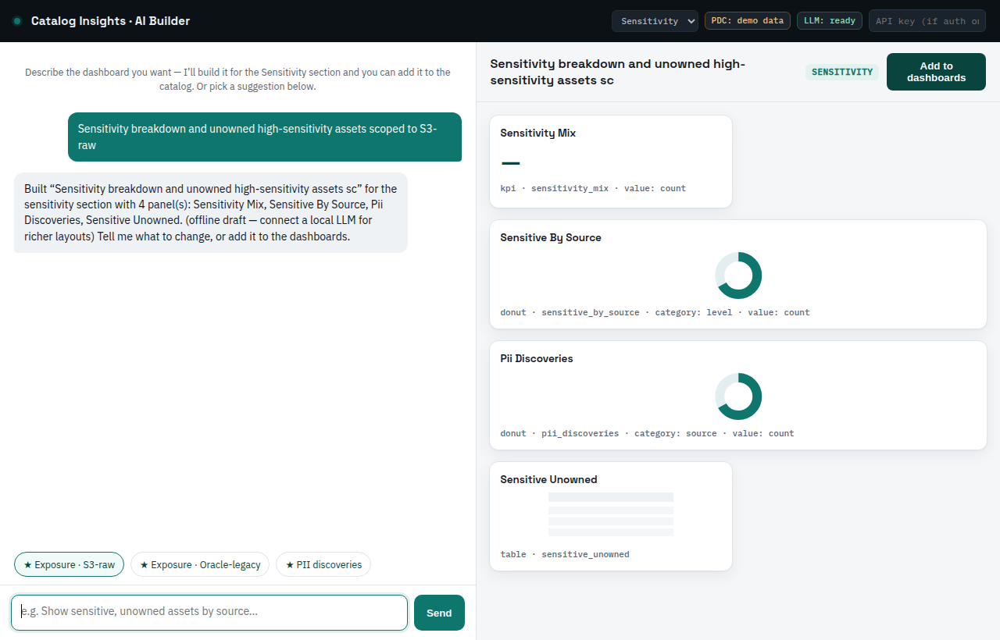

# Catalog Insights

AI-assisted reporting and dashboards for **Pentaho Data Catalog (PDC)**.

Catalog Insights reads governance metrics straight from the PDC public REST
API (trust, quality, sensitivity/PII, glossary coverage, profiling health,
lineage), renders them as navigable dashboards, and lets you **design new
dashboards by hand or generate them from a plain-language prompt** using a
local or commercial LLM.

It is a thin, containerised app — the same shape as the Glossary Generator
(Flask + Docker + bearer auth + env config). It does **not** require a
Pentaho Server or the CTools stack to run; PDC metadata is reached over its
API, not a JDBC source.

---

## Why this exists

PDC catalog data lives behind the REST API (OpenSearch underneath), so the
traditional CDF/CDE/CDA dashboarding route is an awkward fit — you'd be
writing a CDA data access that just proxies the API anyway. Catalog Insights
talks to the API directly. The one endpoint that makes this easy is
`POST /api/public/v3/search/facets`, which returns **pre-aggregated counts**
per facet option — a dashboard data feed in a single call.

For teams that still want CTools artifacts as the deliverable standard, the
Dashboard Studio editor exports CDF/CDE/CDA from the same spec; see
`docs/PDC-CONNECTOR.md` for the bridge pattern.

## Layout

```
app/                 Flask backend
  config.py          env-driven settings (PDC, LLM, brand)
  security.py        auth + roles + audit (shared by web app and MCP)
  pdc_client.py      auth + search + facets + entities (read-only, re-auths on 401)
  catalog.py         catalog snapshot + query library (+ demo fixture)
  recommend.py       dashboard suggestions from catalog state
  generator.py       NL prompt -> validated dashboard spec
  chat_build.py      conversational build + offline fallback (powers /api/chat)
  model_advice.py    GPU/CPU-aware model recommendation (Settings + CLI share it)
  llm/               provider interface + local / commercial backends
  routes/            /health, /api/* (facets, search, snapshot, recommend,
                     generate, chat, dashboards, llm) — each gated by role
  schema/            dashboard.schema.json — the spec contract
  dashboards/        built-in standard dashboards (.studio.json) per section
mcp_server/          MCP server entry point (tools over the same engine, gated)
ui/mock/             design mock + chat.html (the in-app AI builder, served at /chat)
docs/                architecture, dashboards, generator, connector,
                     deployment, mcp, security
tools/               build_dashboards.py · test_security.py · test_app.py ·
                     suggest_model.py · preflight.py
run.sh · run.bat     one-command launch: preflight + GPU/CPU detect + health check
```

## Quickstart

```bash
cp .env.example .env          # fill in PDC + LLM details (or set INSIGHTS_DEMO=true)
```

Run it **natively** (recommended when Ollama is already on the host — `LLM_BASE_URL`
defaults to `http://localhost:11434`, no Docker networking):

```bash
pip install -r requirements.txt
gunicorn --bind 0.0.0.0:8660 --threads 4 wsgi:app   # web app at http://localhost:8660
```

…or in **Docker** (self-contained; compose auto-points the LLM at the host):

```bash
docker compose up --build                       # web app at http://localhost:8660
docker compose --profile mcp up insights-mcp    # + MCP over HTTP at :8765
```

Pick a model for your hardware (GPU or CPU): `python tools/suggest_model.py`,
then `ollama pull <model>`. On Windows, run the app with
`waitress-serve --port=8660 wsgi:app` instead of gunicorn.

**Fastest start — use the launch script** (creates the venv, installs deps,
writes `.env`, auto-detects GPU/CPU, starts the app):

```bash
./run.sh                 # macOS/Linux — web app only (all you need for local LLM)
./run.sh --mcp --pull    # also start the MCP server and download the model
```
```bat
run.bat                  :: Windows — web app only
run.bat --mcp --pull     :: also start the MCP server and download the model
```

Flags: `--gpu`/`--cpu` force model sizing (default auto-detects via `nvidia-smi`),
`--port N`, `--pull` downloads the recommended Ollama model, `--no-venv` uses the
current Python. The web app serves on `http://localhost:8660` (`waitress` on
Windows, `gunicorn` on Linux/macOS).

> **Do you need the MCP server for local LLM? No.** Ollama is called directly by
> the web app for `/chat` and dashboard generation. Start `--mcp` only to drive
> Catalog Insights from an *external* chat/agent like Claude Desktop.

No PDC yet? Set `INSIGHTS_DEMO=true` and everything runs on a bundled sample.

**Full step-by-step setup — Windows 11 + GPU, Linux, co-located, security, and
Claude Desktop — is in [`INSTALL.md`](INSTALL.md).**

## Configuration

Everything is environment-driven (`.env.example`). Key switches:

| Variable        | Purpose                                             |
| --------------- | --------------------------------------------------- |
| `PDC_BASE_URL`  | PDC instance to report on                           |
| `LLM_PROVIDER`  | `local` \| `anthropic` \| `openai` \| `disabled`    |
| `LLM_BASE_URL`  | Ollama / API endpoint                               |
| `INSIGHTS_BRAND_*` | Genericise the product name and accent colour    |

## Standard dashboards

Each Analytics section ships with named, ready-made dashboards (no setup
required) — see `app/dashboards/`. They double as enablement examples: every
one is a valid `.studio.json` spec you can open in the Designer to learn the
format, then duplicate or tweak. Regenerate with `python tools/build_dashboards.py`.

## Two front doors

The same engine is reachable two ways:

- **Web app** (`app/`, `ui/`) — visual dashboards, the Designer, and the AI
  generate drawer. Run with `docker compose up`.
- **MCP server** (`mcp_server/`) — the catalog and generator as tools an LLM or
  agent can call. Ask *"what dashboards should I build from my scans?"*, then
  *"build the PII one for S3"*, and the spec drops into the app. Run with
  `docker compose --profile mcp up insights-mcp` (HTTP) or wire it into Claude
  Desktop over stdio. See `docs/MCP-SERVER.md`.

Both reuse the same `pdc_client.py` and `generator.py` — no duplicated logic.

## Build dashboards by chat (in the app)

The web app includes a chat window at **`/chat`** that builds dashboards
conversationally and adds them to the catalog: describe what you want, it grounds
on the real Query Library, previews the spec, and on **Add to dashboards** writes
it into the right Analytics section. It’s **section-aware**: open `/chat?section=sensitivity` (or use the **Build with
AI** button inside any Analytics section) and the starter suggestions are the
recommended dashboards for that section — ranked by real catalog signals — and
new dashboards are pinned to it. It uses the local LLM when configured and a
deterministic builder otherwise, so it works even before Ollama is wired up.



This is the same engine the MCP server exposes — `/chat` is the built-in chat;
the MCP server is for *external* chats (Claude Desktop, agents).

Every dashboard — standard or chat-built — can be **downloaded** as a `.studio.json` spec or **printed / saved as PDF** (a print stylesheet lays out just the dashboard, so the browser's Save-as-PDF gives a clean report).

## Security

Auth, roles, and audit live in `app/security.py` and are enforced identically by
the web app and the MCP server. Three roles (`viewer` < `steward` < `admin`,
mirroring PDC's tiers); the only write — saving a dashboard — is gated to
`steward`. Auth modes via `INSIGHTS_AUTH`: `none` (local dev), `apikey`, or `jwt`
(shared secret or JWKS, with role-claim mapping for Okta/Entra). Every privileged
action is audited as JSON. The PDC service account stays read-only and scoped in
PDC — this layer is defense-in-depth on top. Full detail in `docs/SECURITY.md`;
verify with `python tools/test_security.py`.

## Try it without a live PDC

Set `INSIGHTS_DEMO=true` and the snapshot/recommend/dashboard paths serve a
bundled sample catalog — both the web API and the MCP `recommend_dashboards`
loop work offline, which is handy for enablement.

## Where it runs

The app is a stateless client to PDC + an LLM endpoint — no Pentaho Server,
CTools, or Semantic Model Editor in the path. It runs fine co-located with PDC
(lab) or on its own small host (production), and on a Windows 11 box with local
GPUs via Ollama. Full topology, co-location trade-offs, and the Windows / RTX
setup are in `docs/DEPLOYMENT.md`.

## Documentation

| Doc | What it covers |
| --- | -------------- |
| [`INSTALL.md`](INSTALL.md) | Step-by-step install: Windows 11 + GPU, Linux, co-located, security setup, Claude Desktop |
| [`docs/ARCHITECTURE.md`](docs/ARCHITECTURE.md) | How the pieces fit; the spec-as-contract; why no Pentaho Server |
| [`docs/DIAGRAMS.md`](docs/DIAGRAMS.md) | All architecture & flow diagrams (rendered + Mermaid source) |
| [`docs/DEPLOYMENT.md`](docs/DEPLOYMENT.md) | Topology, co-location trade-offs, Windows + RTX sizing |
| [`docs/SECURITY.md`](docs/SECURITY.md) | Auth modes, roles, audit, defense-in-depth, caveats |
| [`docs/MCP-SERVER.md`](docs/MCP-SERVER.md) | The MCP tools, the suggest-then-build loop, how to connect |
| [`docs/DASHBOARDS.md`](docs/DASHBOARDS.md) | The dashboard catalog mapped to API feeds and charts |
| [`docs/LLM-GENERATOR.md`](docs/LLM-GENERATOR.md) | Prompt + schema contract, grounding, local vs commercial |
| [`docs/PDC-CONNECTOR.md`](docs/PDC-CONNECTOR.md) | Direct-API path + the optional CDA/CTools bridge |

## Status

Design mock + 12 built-in dashboards + in-app AI builder (section-aware chat) +
MCP server + enforced security model (auth/roles/audit). Two test suites cover
it: `tools/test_security.py` (auth/roles/audit) and `tools/test_app.py`
(recommend, the chat builder, the routes) — both run on demo data with no PDC or
LLM. Runs end-to-end in demo mode today.

Still to do against a live 10.2.11 instance: wire the dashboard panels to live
PDC reads (they’re demo-backed now), verify the trust-score read paths (see the
note in `pdc_client.py`), and validate the MCP HTTP OAuth handshake against your
IdP.
