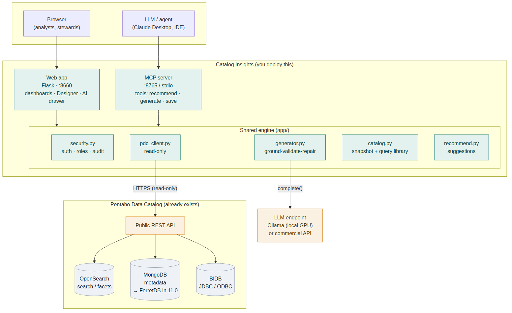
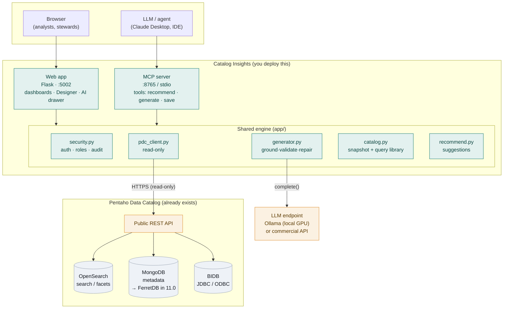
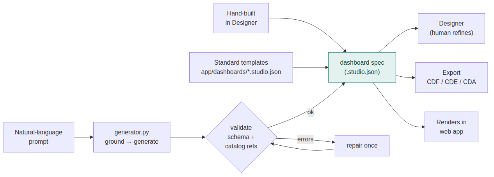
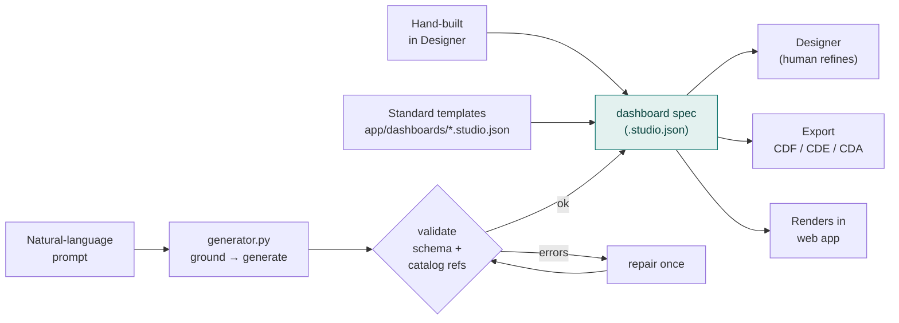
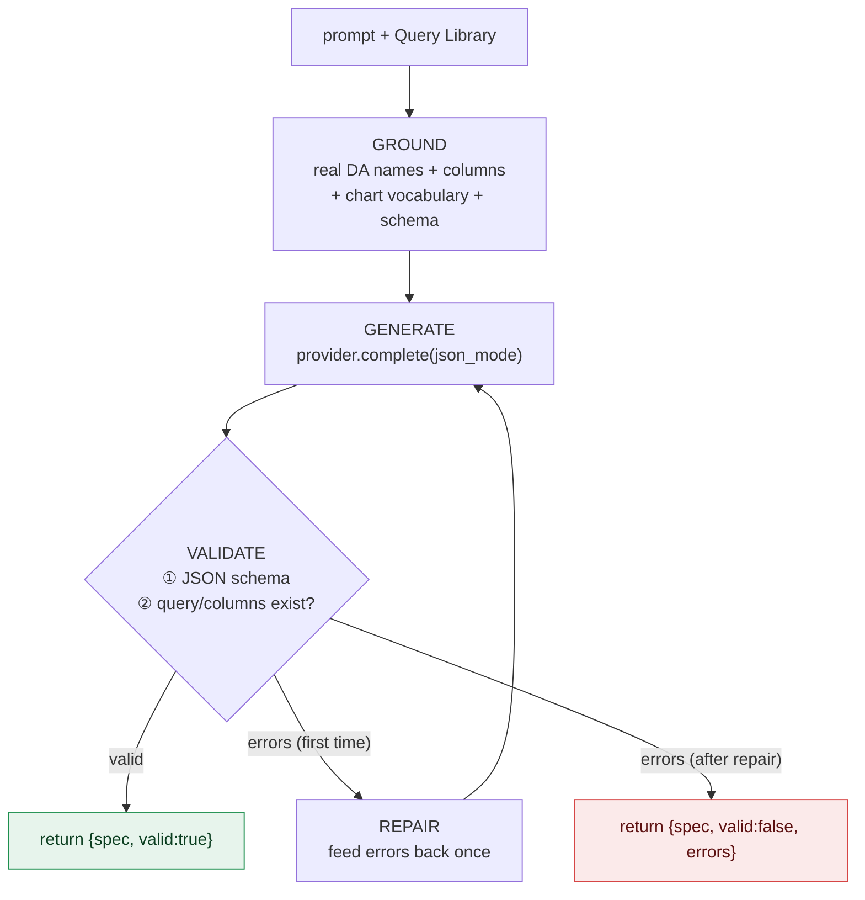
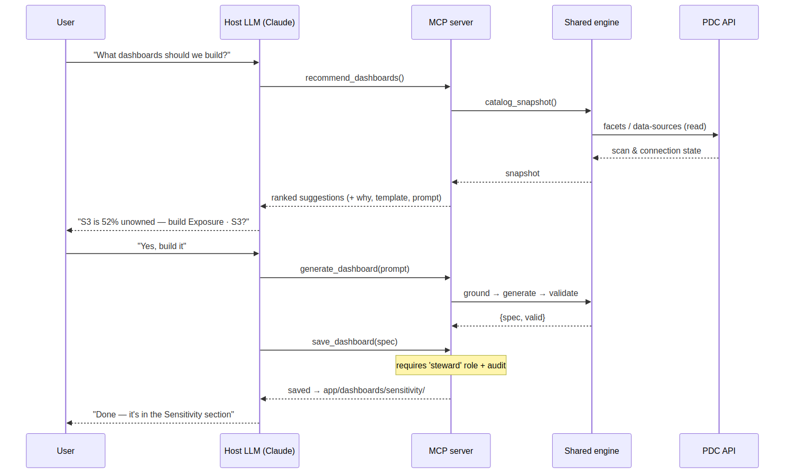
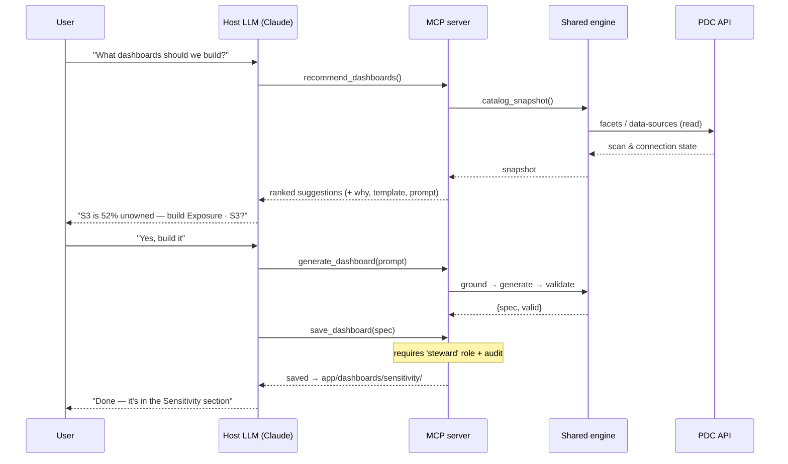
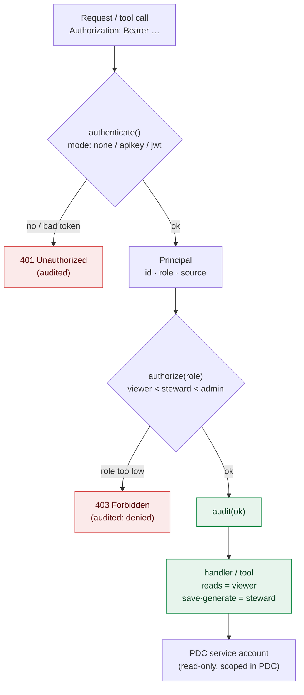

# Diagrams

Visual reference for the architecture and the main flows. Each diagram is a
rendered PNG plus its Mermaid source (which renders inline on GitHub/GitLab).
Regenerate the PNGs with `mmdc -i <file>.mmd -o <file>.png -b white`.

## System architecture

Two front doors (web app + MCP server) over one shared engine. The engine is the only thing that talks to PDC — read-only, over the public REST API — and to the LLM endpoint. PDC's internal stores (OpenSearch, MongoDB, BIDB) sit behind that API and are never touched directly.

Mermaid source

## Dashboard spec lifecycle

The `.studio.json` spec is the single contract. Three producers (a prompt, the Designer, the standard templates) converge on one validated spec, which the Designer refines, the exporters turn into CDF/CDE/CDA, and the web app renders.

Mermaid source

## LLM generate–validate–repair loop

Why generation is low-risk: the model targets one JSON schema, is grounded on the real query library, and every result is validated (schema + catalog references) with a single repair pass before it's returned.

Mermaid source

## Suggest-then-build over MCP

The agentic loop: the host asks the MCP server to recommend dashboards from live scan/connection state, the user picks one, and generate → validate → save drops a new dashboard into the app. Saving requires the steward role and is audited.

Mermaid source

## Security model

One model enforced by both front doors: authenticate (none/apikey/jwt) → authorize (viewer < steward < admin) → audit → handler. The PDC service account stays read-only and scoped in PDC as the real backstop.

Mermaid source

