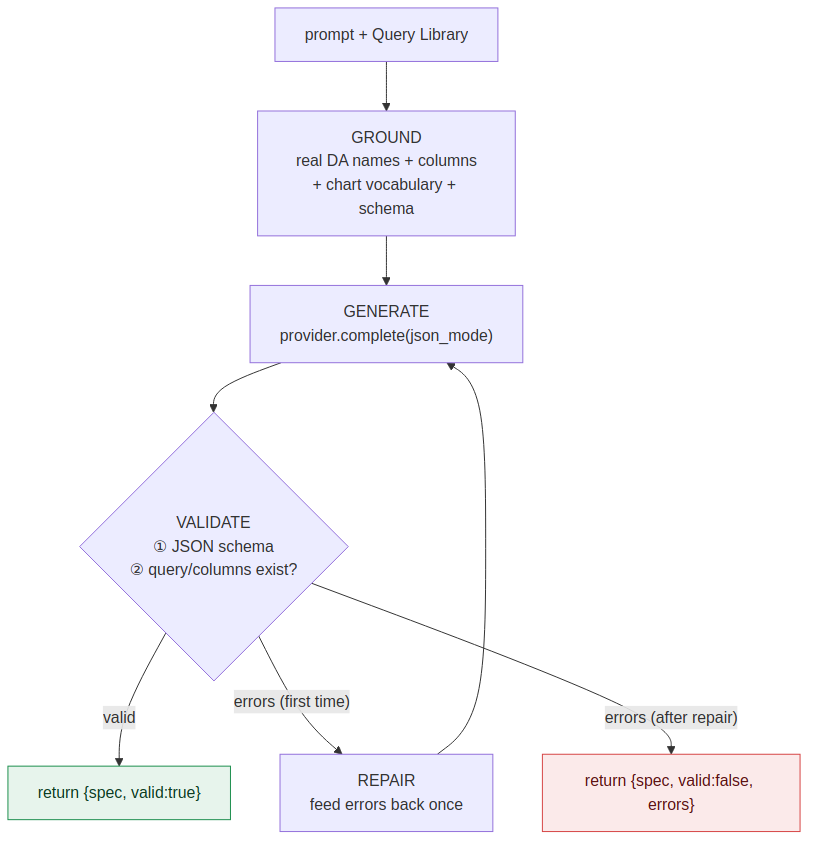

# LLM dashboard generator

Turns a plain-language request ("trust score and PII coverage by source")
into a validated dashboard spec the editor can load. Reliability comes from
**grounding and validation**, not prompt cleverness.

## The loop



```
prompt + query catalog
        │
        ▼
  ground  ──▶  build the user message: real DA names + columns + sample
        │      rows, the allowed chartType enum, the JSON schema
        ▼
  generate ─▶  provider.complete(system, user, json_mode=True)
        │
        ▼
  validate ─▶  jsonschema  +  cross-check every query/column against the
        │      catalog. On failure, feed errors back ONCE for repair.
        ▼
  return  ──▶  { spec, valid, errors }  — editor loads it, human refines
```

Nothing auto-deploys. The model produces a draft; the person tunes it in the
Designer; export happens on an explicit action.

## Why it stays grounded

The model only sees queries that actually exist and the columns each one
exposes (the same name + columns + 3 sample rows the inspector already
surfaces). Binding to anything else is caught by `_validate()` and repaired.
So the failure mode is "a slightly wrong but valid dashboard," not "a
dashboard referencing a table that isn't there."

## System prompt

See `SYSTEM_PROMPT` in `app/generator.py`. In short: output one JSON object
conforming to the schema, no prose; use only catalog queries and columns;
match chartType to data shape; prefer 3–6 panels, KPIs first.

## Grounding payload

```jsonc
{
  "prompt": "trust score and PII coverage by data source",
  "catalog": [
    { "name": "trust_by_source", "group": "Governance",
      "columns": ["source", "bucket", "count"],
      "sampleRows": [["Snowflake", "Highly Trusted", 412]] },
    { "name": "pii_discoveries", "group": "Sensitivity",
      "columns": ["pii_type", "count", "source"],
      "sampleRows": [["EMAIL", 1203, "S3-raw"]] }
  ]
}
```

## Output

```jsonc
{
  "spec": { "version": 1, "title": "...", "category": "governance",
            "panels": [ /* kpi / chart / table / text */ ] },
  "valid": true,
  "errors": []
}
```

The `spec` conforms to `app/schema/dashboard.schema.json`.

## Two jobs, two risk levels

| Job | What it makes | Risk | Guardrail |
| --- | ------------- | ---- | --------- |
| Dashboard generation | a `.studio.json` spec | low — touches no live system | schema + catalog validation |
| Data-access generation | a new CDA query body | higher — hits live data | dry-run / preview before save |

This module implements the first. DA generation is a later milestone and
must keep a human-confirmed dry-run before any query can be saved.

## Local vs commercial

| | Local (Ollama/llama.cpp) | Commercial (Claude / OpenAI) |
| --- | --- | --- |
| Metadata leaves env | no | yes |
| Cost | none | per token |
| JSON reliability | needs `format=json` | strong native JSON |
| Default for governance | **yes** | opt-in |

For a governance product, default to local and make commercial opt-in —
sending catalog and PII metadata to a third party undercuts the value PDC
customers bought. The provider is chosen by `LLM_PROVIDER`; switching is an
env change, never a code change.
