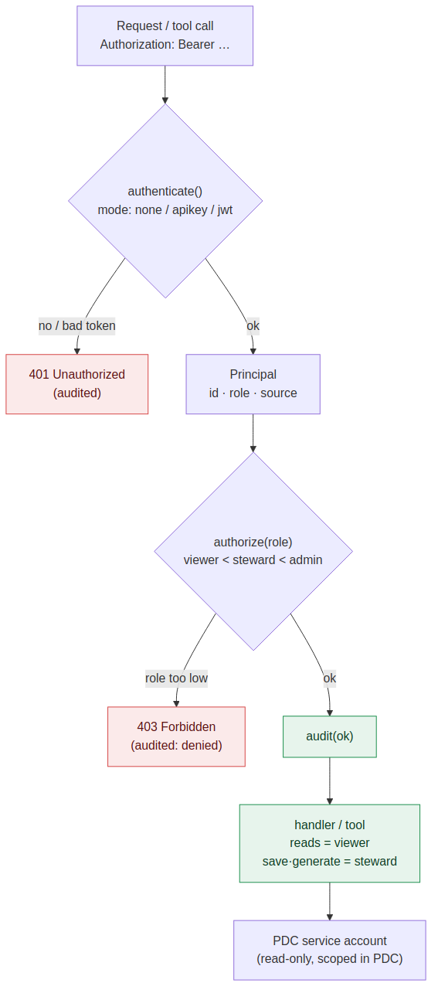

# Security model




One model, enforced identically by both front doors. The web app and the MCP
server share `app/security.py` — authenticate, authorize, audit — so a rule
written once applies to clicks and to tool calls alike.

```
  request / tool call
        │  Authorization: Bearer <token>
        ▼
  authenticate ──▶ Principal { id, name, role, source }
        │
        ▼
  authorize(role)  ── role hierarchy: viewer < steward < admin
        │
        ▼
  audit ──▶ append-only JSON record (who / what / when / allowed?)
```

## Roles

Modelled on PDC's own expert tiers, so the app's roles line up with what the
catalog enforces underneath:

| App role | ~ PDC role | Can |
| -------- | ---------- | --- |
| `viewer` | Analyst | read dashboards, snapshot, recommendations, search |
| `steward` | Data / Business Steward | + generate and save dashboards |
| `admin` | Admin | + read config / audit, manage settings |

Higher roles inherit everything below them. The only **write** in the whole
surface is saving a (validated) dashboard spec — gated to `steward`.

## Authentication modes

Set `INSIGHTS_AUTH`:

- **`none`** — open. Every caller is treated as `INSIGHTS_DEFAULT_ROLE`. Local
  development and stdio MCP only. Never use in a shared deployment.
- **`apikey`** — bearer tokens from `INSIGHTS_API_KEYS` (`key:name:role,…`).
  Simple, good for service-to-service and small teams.
- **`jwt`** — bearer JWT validated against a shared secret (`INSIGHTS_JWT_SECRET`)
  or a JWKS URL (`INSIGHTS_JWT_JWKS_URL`). The role comes from a configurable
  claim, with `INSIGHTS_JWT_ROLE_MAP` translating your IdP's role names
  (e.g. `Data Steward:steward`). This is the path to put the app behind Okta /
  Entra and reuse existing identities.

The same token flows to the MCP server over HTTP: a `TokenVerifier` validates it
and the verified scopes drive the per-tool gate. Over stdio (Claude Desktop) the
boundary is the OS user, and the configured default role applies.

## Layers (defense in depth)

1. **MCP/web auth** — who can call anything (above).
2. **Per-action authorization** — each endpoint/tool declares a minimum role;
   reads need `viewer`, save/generate need `steward`.
3. **The PDC service account** — the credential this app uses (`PDC_USERNAME` or
   a token) should be **read-only and scoped in PDC**. Even a fully compromised
   call can't exceed what that account can see. This is the real backstop, and
   it lives in PDC, not here.
4. **Blast radius** — tools return *metadata only* (counts, scores, names), never
   row-level data; with `LLM_PROVIDER=local` that metadata never leaves the
   environment even during generation.
5. **Audit** — every privileged action emits one JSON line (principal, role,
   source, action, target, status) to `INSIGHTS_AUDIT_LOG`. Denials are logged
   too, so you can see attempts, not just successes.

## What is deliberately not exposed

- No tool or endpoint mutates the catalog. There is no trust-score recalculation,
  no data-source management, no profiling trigger. The only write is a dashboard
  spec file inside the app.
- Keeping the write surface this small is also the main mitigation against
  **prompt injection**: catalog metadata (asset names, descriptions, term text)
  can carry adversarial instructions an LLM might read, so the agentic surface is
  intentionally read-heavy with one validated write.

## Caveats

- `INSIGHTS_AUTH=none` is open by design — fine for a laptop, unsafe shared.
- The MCP HTTP transport-level OAuth metadata is wired but only exercised when
  `INSIGHTS_AUTH != none`; validate the full handshake against your IdP before
  relying on it in production.
- This layer complements PDC's access control; it does not replace it. Scope the
  service account in PDC to exactly what these dashboards should expose.

## Verify it

```bash
python tools/test_security.py
```

Exercises core auth/roles, the web API (401 / 403 / 200 by role), the gated
MCP tools, and audit emission — all on demo data, no live PDC needed.
